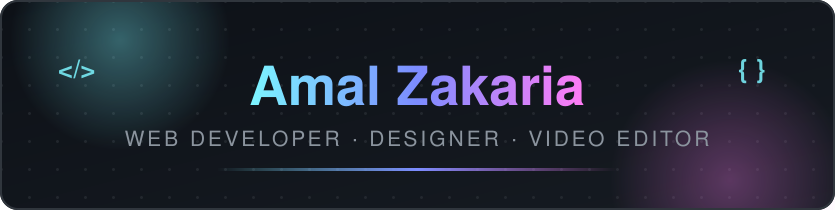

  

  
  
  

---

##  About Me

I'm a passionate **freelancer** who loves building things for the web and crafting visual designs. I enjoy turning ideas into clean websites, eye-catching logos, and engaging videos.

-  Currently sharpening my skills and preparing new projects to showcase
-  Growing in **Web Development**, **App Design**, and creative editing
-  Skilled in **PHP, JavaScript, MySQL**, graphic design, and video editing
-  I design, code, and edit — all in one workflow

---

##  Tech & Tools

  

---

##  What I Do

<table>
  <tr>
    <td width="50%">
      <h3> Web Development</h3>
      
Modern, responsive websites built with <b>PHP, JavaScript, MySQL, HTML &amp; CSS</b> — from landing pages to full web apps.

    </td>
    <td width="50%">
      <h3> Logo &amp; Graphic Design</h3>
      
Modern, unique brand identities and visual content that make businesses stand out.

    </td>
  </tr>
  <tr>
    <td width="50%">
      <h3> App Design</h3>
      
Clean desktop and mobile application designs focused on usability.

    </td>
    <td width="50%">
      <h3> Video &amp; Image Editing</h3>
      
Engaging clips for YouTube, social media, and promotions — plus high-quality photo retouching.

    </td>
  </tr>
</table>

---

##  GitHub Stats

  
  

---

##  Featured Project

  

---

##  Contribution Graph

  <picture>
    <source media="(prefers-color-scheme: dark)" srcset="https://raw.githubusercontent.com/amalzakaria295-png/amalzakaria295-png/output/github-snake-dark.svg">
    <source media="(prefers-color-scheme: light)" srcset="https://raw.githubusercontent.com/amalzakaria295-png/amalzakaria295-png/output/github-snake-light.svg">
    
  </picture>

---

##  Let's Connect

  
  

  <i> Want to work together? Drop me an email — I'm available for freelance projects.</i>

